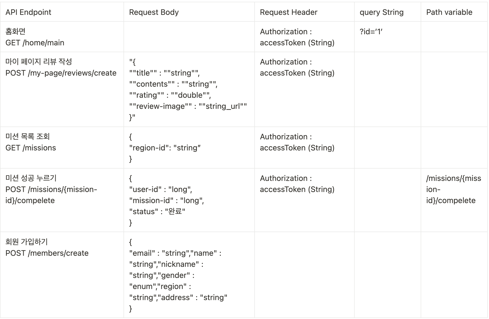

| API Endpoint | Request Body | Request Header | query String | Path variable |
| --- | --- | --- | --- | --- |
| 홈화면
GET /home/main |  | Authorization : accessToken (String) | ?id=’1’ |  |
| 마이 페이지 리뷰 작성
POST /my-page/reviews/create | "{
""title"" : ""string"",
""contents"" : ""string"",  
""rating"" : ""double"",
""review-image"" : ""string_url""
}" | Authorization : accessToken (String) |  |  |
| 미션 목록 조회
GET /missions | {
"region-id": "string”
} | Authorization : accessToken (String) |  |  |
| 미션 성공 누르기
POST /missions/{mission-id}/compelete | {
"user-id" : "long",
"mission-id" : "long",
"status" : "완료"
} | Authorization : accessToken (String) |  | /missions/{mission-id}/compelete |
| 회원 가입하기
POST /members/create | {
"email" : "string","name" : "string","nickname" : "string","gender" : "enum","region" : "string","address" : "string"
} |  |  |  |

 - 
